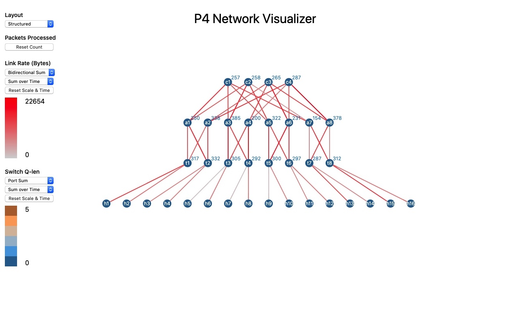

# Network Visualizer



*Follow updates at https://github.com/Danieltech99/P4-Network-Visualizer*


## Features


- Provides two layout options to visualize the p4 switch network. The graph is generated with p4utils and thus only requires defining the network in the topology json.
    - The two layout options (**Structured** and **Force Driven**) can be switched with the layout dropdown.
    - Structured layout is a special layout that seperates switches into rows. The layout looks for switches/hosts that start with the a letter. This layout places all nodes in vertical levels according to the alphabetic level of the letter. The layout orders nodes horizontally by the number following the single letter. **This layout is works especially well for fattree topologies but only if the levels are ordered alphabetically.**
- Monitors three registers/statistics per switch:
  - **Packets Processed Per Switch:** A count of the number of packets that have entered the ingress pipeline of the switch. This is represented by the number on the top right of each switch.
    - *It is possible to modify this to count the number of packets that leave the egress pipeline by following **Option 2** of **Usage** and moving the **inport_packets** register and operations to the egress pipeline.*
  - **Link Rate (Bytes)**: A measure of the bytes flowing through a link. The visualizer monitors the bytes that enter through each port every RATE (with the units bytes per RATE seconds). Links in p4 are bidirectional and thus there are two measures for each link; use the first dropdown under **Link Rate** to specify which measure gets shown or if they should be combined into another metric. The chosen metric is represented with by the color of the link as part of a link rate heatmap.
    - *Measured through the **packet_length** register.*
    - Link rate has two additional filters available only with the **Structured Layout**: **Upstream** and **Downstream**. Upstream shows the link rate as traffic goes from a lower node to a higher node in the structured layout; downstream shows the rate as traffic goes from a higher node to a lower node (by default, this is measured as it enters a switch, this their is no downstream rate into a host because the host is not a switch and does not measure through an ingress pipeline).
  - **Switch Queue Length**: A measure of the number of packets in the ingress queue. This is represented by the color of the switch as part of a queue length heatmap.
    - *Measured through the **inport_qlen** register.*
- Two out of the three above metrics (Link Rate and Switch Queue Length) has a time analysis component.
  - Real Time: The current measure of the metric.
  - Min Over Time: The minimum value from start/reset until now.
  - Max Over Time: The maximum value from start/reset until now.
  - Sum Over Time: The sum of each reported value from start/reset until now.
- Heatmap: the heatmap provides a visual representation of congestion, traffic or activity.
  - Adjustable range: each heatmap starts off with a small range and expands as metrics are reported out of the range. This way you can run an entire scenario and see the most busiest paths. This is especially useful when you run the application or scenario twice, the first to set the range and the second to watch it in the set range. However, do note that the range does not shrink, so if you are running a scenario with considerably less traffic after one with a great deal of traffic, make sure to reset the scale.

***RATE** is the polling rate of the visualizer in terms of seconds. This can be modified through the command in the **Usage* section.**


## Possible Use Cases:
- **Identifying disconnected paths:**
  - Set link rate to Bidirectional Max and Max Over Time and then run the scenario; when the scenario is finished, any links at the bottom of the heatmap (gray) had the least traffic.
- **Identifying congested paths:**
  - Set link rate to Bidirectional Sum and Sum over Time and then run the scenario; when the scenario is finished, any links at the top of the heatmap (red) had the most traffic.
- **Measuring Path Redirection or Congestion Control:**
  - Set link rate to Bidirectional Sum and Sum over Time and then run the scenario; when the scenario is finished, a well designed congestion control will result in multiple links of the same color between your set of senders and recievers.


## Example (Fattree with ECMP)

**Make sure you have the Dependencies setup first.**

Steps to get up an running with the example:
1. *Shell 1*
  ```shell
  cd example/binary
  sudo p4run --conf topology/p4app_bin.json
  ```

2. *Shell 2* (In another shell)
   ```shell
   cd example/binary
   python controller/controller_bin.py 4
   python3 ../../app/main.py --ports 3
   ```

3. Open a browser and navigate to the url presented by the second shell (most likely 0.0.0.0:8000) or the machine's url with port 8000. (*If restarting the script results in 'Address already in use', try 'sudo killall python3'*)


## Dependencies

This package requires **BOTH** python 2 and python 3.

*This is because a dependency, p4utils, is only compatible with python 2 and the realtime websocket server is only compatible with python 3.*

```shell
path/to/python2 -m pip install -r app/python2.7/requirements.txt
path/to/python3 -m pip install -r app/python3/requirements.txt
```

*If python3 pip is not installed on a linux-like machine, use instructions like the following, then rerun the python3 pip install*
```shell
wget https://bootstrap.pypa.io/get-pip.py
python3 get-pip.py
```

**Python 2**
- nsg-ethz/p4-utils (topology & sswitch_API utils)
- websocket_client^0.57.0

**Python 3**
- websockets^7.0

To use this package, you must include the following in your p4 code. After including the code you can run the package with the command listed below.


## Usage

**Starting the Package (AFTER including the p4 code)**
```shell
path/to/python2or3 main.py [-h] [-p2 PATH] [-p3 PATH]
```

There are two ways to include the p4 code.

### P4 Code

#### Option 1: Macros

1.  Before the ingress and egress pipelines/controls or at the top of your file. Make sure to set this equal to the number of ports per switch and update the path to the path of this package.
    ```p4
    #define NUM_PORTS   4
    #include "../network-visualizer/p4/visualizer.p4"
    ```

1.  Include INGRESS_REGISTERS in the ingress control and INGRESS_APPLY in the ingress apply.
    ```c
    control MyIngress(...) {
        ...
        INGRESS_REGISTERS
        
        apply {
            INGRESS_APPLY

            ...
        }
    }
    ```


1.  Include EGRESS_REGISTERS in the egress control and EGRESS_APPLY in the egress apply.  
    ```c
    control MyEGRESS(...) {
        ...
        EGRESS_REGISTERS
        
        apply {
            EGRESS_APPLY

            ...
        }
    }
    ```


#### Option 2: Copy the Code

If including the macros disrupts your syntax highlighting or is not compatible with your compiler, you can include the following code in place of the macros.


1.  Before the ingress and egress pipelines/controls. Make sure to set this equal to the number of ports per switch.
    ```p4
    const bit<32> NUM_PORTS = 4;
    ```

1.  Include this register in the ingress control and the following register operations in the ingress apply.  
    ```c
    control MyIngress(...) {
        ...
        register<bit<32>>(NUM_PORTS) inport_packets;
        register<bit<32>>(NUM_PORTS) packet_length;
        
        apply {
            bit<32> prev_packet_value;  
            inport_packets.read(prev_packet_value, (bit<32>)standard_metadata.ingress_port);
            inport_packets.write((bit<32>)(standard_metadata.ingress_port), prev_packet_value + 1);
            packet_length.read(prev_packet_value, (bit<32>)standard_metadata.ingress_port);
            packet_length.write((bit<32>)(standard_metadata.ingress_port), prev_packet_value + standard_metadata.packet_length);

            ...
        }
    }
    ```


1.  Include this register in the egress control and the following register operations in the egress apply.  
    ```c
    control MyEGRESS(...) {
        ...
        register<bit<32>>(NUM_PORTS) inport_qlen;
        
        apply {
            bit<32> prev_qlen;
            inport_qlen.read(prev_qlen, (bit<32>)standard_metadata.ingress_port);
            inport_qlen.write((bit<32>)standard_metadata.ingress_port, prev_qlen + (bit<32>)standard_metadata.enq_qdepth);

            ...
        }
    }
    ```


## Project Components

- Graph/Network Rendering (www/)
- Python3 Websocket Server (app/python3/server.py)
- Python2.7 Websocket Client (app/python2.7/client.py)
- Python2.7 P4 Network Tools/Monitoring (app/python2.7/watcher.py)

*Reasoning: Live network rendering is best done through websockets. However python2.7 does not support a websocket server and p4utils does not support python3; thus we need both python3 and python2.7; relay runs as python3 and spawns watcher with python2.7.*